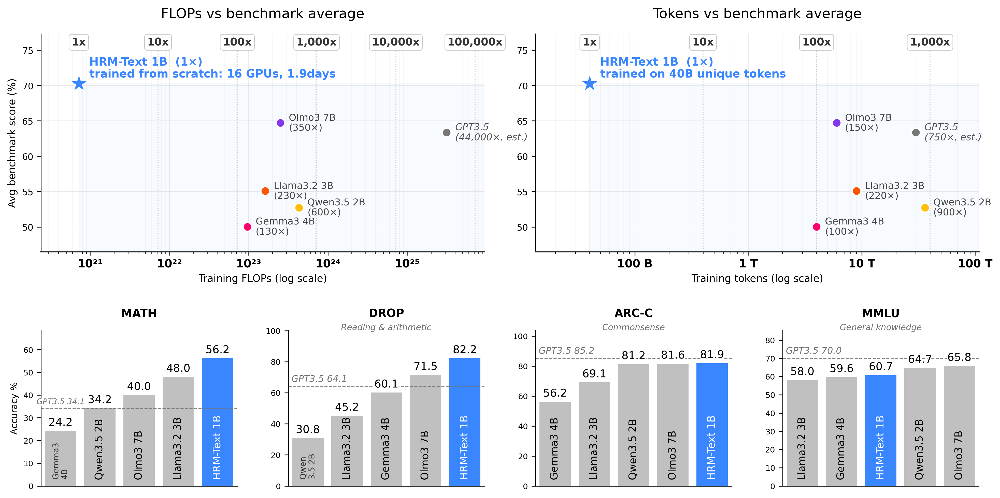

# HRM-Text: Efficient Pretraining Beyond Scaling

<p align="center">
  <a href="https://sapientinc.github.io/HRM-Text/assets/HRM_Text.pdf"></a>
  <a href="https://huggingface.co/sapientinc/HRM-Text-1B"></a>
</p>

<p align="center"><strong>🌟 Pretrain a foundation model from scratch with ~$1000. 🌠</strong></p>

HRM-Text is a 1B text generation model based on the HRM architecture, strengthened by task completion and latent space reasoning. It offers a full pretraining framework, making foundation model pretraining accessible with 130-600x less compute and 150-900x less data. It is built upon a hierarchical recurrent architecture, PrefixLM sequence packing, FlashAttention 3 kernels, PyTorch FSDP2 training, evaluation, and checkpoint conversion tooling.



## Launch the Pretraining 🚀

### Required Resources

Choose a target size and prepare the corresponding GPU nodes.

- **L, 0.6B parameters:** 8 H100s, single node, about 50 hours (~$800).
- **XL, 1B parameters:** 16 H100s, two nodes, about 46 hours (~$1472).

*Price estimation based on $2/H100 hour.*

The following are benchmark results from the reference runs.

| Size | GPUs | Time | GSM8k | MATH | DROP | MMLU | ARC-C | HellaSwag | Winogrande | BoolQ |
| --- | ---: | ---: | ---: | ---: | ---: | ---: | ---: | ---: | ---: | ---: |
| **L (0.6B)** | 8 | 50 hrs | 77.6% | 51.2% | 78.6% | 56.6% | 75.9% | 52.7% | 67.6% | 85.0% |
| **XL (1B)** | 16 | 46 hrs | 84.7% | 56.5% | 82.3% | 60.7% | 81.9% | 63.4% | 72.4% | 86.2% |

> Hopper-class GPUs are the expected training target because the attention path depends on FlashAttention 3.

### 1. Prepare Data

HRM-Text trains from sampled, tokenized data produced by the companion `data_io` pipeline. Use `data_io` to clean, tokenize, and stratified-sample the pretraining corpus, then point HRM-Text at the sampled output.

<p align="center">
  <a href="https://github.com/sapientinc/data_io"></a>
</p>

Recommended setups:

1. **Single node:** run the data pipeline and pretraining on the same node. After tokenization, stratified-sample into this repo's ignored `data/sampled` directory.
2. **Multi-node:** keep `data_io` and the tokenized data on shared storage. Mount or expose that directory on every pretraining node, then run stratified sampling independently on each node. Sampling is fast and deterministic, so every node produces the same in-memory training data.

Please first setup `data_io`, then run the pipeline. After tokenization, run stratified sampling on each training node.

```bash
cd <DATA_IO_PATH>
python sample_tokenized.py epochs=4 output_path=<HRM_TEXT_PATH>/data/sampled > show_analytics.md
```

HRM-Text uses 4 training epochs by default. If you change `epochs` in the training config, change the sampling command to match.

### 2. Start the Environment

Set up the same environment on every pretraining node.

#### Recommended: Docker

We recommend running through the published Docker image that contains the full environment. Make sure Docker can see your GPUs, for example through NVIDIA Container Toolkit.

From the repo's directory:

```bash
docker run --gpus all --ipc=host --network=host -it \
  -v "$PWD":/workspace \
  sapientai/hrm-text:latest
```

For multi-node runs, mount the same shared workspace on every node. Keeping the code, tokenized data, and checkpoint directory at identical paths avoids version drift between ranks and makes FSDP2 checkpointing straightforward. A common layout is:

```text
/shared/
|-- HRM-Text/
   |--- checkpoints/
|-- data_io/
```

#### Alternative: Install from Source

If you are not using Docker, first install PyTorch, CUDA, and FlashAttention 3. The tested versions are documented in [`docker/Dockerfile`](docker/Dockerfile).

Then install the Python dependencies:

```bash
pip install -r requirements.txt
```

#### Check Distributed Communication

For multi-node runs, verify NCCL before starting a long job. At minimum, confirm that `torchrun` can initialize across the intended nodes. If your cluster provides `nccl-tests`, run both intra-node and inter-node bandwidth checks.

#### Set Up W&B Tracking

HRM-Text logs training metrics to [Weights & Biases](https://wandb.ai/). Log in before launching training:

```bash
wandb login
```

For headless runs, get an API key from <https://wandb.ai/authorize> and run:

```bash
wandb login <API_KEY>
```

### 3. Launch Pretraining

For the **L**-size reference run on one 8xH100 node:

```bash
OMP_NUM_THREADS=1 MKL_NUM_THREADS=1 \
torchrun --nproc_per_node=8 pretrain.py arch/size@arch=L lr=2.5e-4 global_batch_size=172032
```

For the **XL**-size reference run on two 8xH100 nodes, run this on each node:

```bash
OMP_NUM_THREADS=1 MKL_NUM_THREADS=1 \
torchrun \
  --nproc_per_node=8 \
  --nnodes=2 \
  --node_rank=<NODE_RANK> \
  --master_addr=<MASTER_ADDR> \
  --master_port=<MASTER_PORT> \
  pretrain.py
```

Checkpoints are saved every epoch under `checkpoints/`. Remember for multi-node runs, each node only saves its own shard, so we recommend mounting a shared storage.

### 4. Evaluate

Evaluation loads the latest checkpoint epoch automatically when `ckpt_epoch` is not provided:

```bash
python -m evaluation.main ckpt_path="checkpoints/..."
```

To run a specified set of benchmarks, append `run_only=[MATH,DROP,ARC,MMLU]` to the command

Evaluation typically needs one 80 GB GPU. If evaluation runs out of memory, lower the batch size by adding `generation_config.batch_size=16`

The evaluation scripts use Hugging Face `datasets`, so benchmark data is downloaded on demand.

### 5. Export to Transformers Format

```bash
python -m conversion.convert_to_hf \
  --ckpt_path "checkpoints/..." \
  --out_dir "<OUTPUT_PATH>"
```

For evaluation and export, EMA weights are used by default when EMA is present in the checkpoint.

## Status

- Training, checkpointing, and evaluation are implemented in this repository.
- Transformers-format export is implemented in [`conversion/convert_to_hf.py`](conversion/convert_to_hf.py).
- Native Transformers model support is merged and scheduled for the next release.
- Native vLLM support for HRM-Text checkpoints is in progress.

## Training Overrides

The default pretraining config is [`config/cfg_pretrain.yaml`](config/cfg_pretrain.yaml):

If `project_name`, `run_name`, or `checkpoint_path` are omitted, rank 0 derives them from the dataset path, architecture name, and a generated slug.

Hydra overrides can be passed directly on the command line:

```bash
# Train a vanilla Transformer architecture, size L
torchrun --nproc_per_node=8 pretrain.py \
  arch/net@arch=transformer \
  arch/size@arch=L
```

## Model Configurations

Architectures live under [`config/arch/net`](config/arch/net):

| Config | Model |
| --- | --- |
| `hrm` | HRM-Text |
| `transformer` | Standard Transformer wrapper |
| `trm` | Tiny Recursive Model baseline |
| `trm_match_recurrence` | TRM configured to match HRM recurrence with half parameters |
| `rins` | Recursive Inference Scaling (RINS) baseline |
| `ut` | Universal Transformer baseline |

Sizes live under [`config/arch/size`](config/arch/size):

| Config | Layers | Hidden | Heads |
| --- | ---: | ---: | ---: |
| `XXS` | 6 | 256 | 2 |
| `XXS_wide` | 4 | 384 | 3 |
| `XS` | 6 | 512 | 4 |
| `S` | 8 | 768 | 6 |
| `B` | 12 | 1024 | 8 |
| `L` | 24 | 1280 | 10 |
| `XL` | 32 | 1536 | 12 |
| `XXL` | 72 | 1792 | 14 |
| `XXL_wide` | 32 | 2560 | 20 |
| `XXXL` | 96 | 2048 | 16 |
| `XXXXL` | 128 | 2560 | 20 |

For HRM and RINS, `half_layers: true` splits the configured layer count evenly between the H and L modules.

## Repository Layout

```text
HRM-Text/
|-- config/                       # Hydra configs for model, data, and training
|-- conversion/convert_to_hf.py    # FSDP2 checkpoint -> HF-style export
|-- evaluation/                    # Evaluation engines, benchmark wrappers, configs
|-- models/                        # HRM, recurrent baselines, Transformer blocks, LM head
|-- docker/                        # Tested CUDA/PyTorch/FlashAttention environment
|-- dataset_new.py                 # PrefixLM packed dataset loader
|-- multipack_sampler.py           # Distributed multipack batch sampler
|-- pretrain.py                    # FSDP2 pretraining entrypoint
|-- simple_inference_engine.py     # Checkpoint loader and compiled generation engine
`-- requirements.txt
```

## Technical Notes

- [`dataset_new.py`](dataset_new.py) loads sampled `tokens.npy` and per-epoch index arrays, builds PrefixLM batches, masks instruction tokens by default, and emits FlashAttention sequence metadata.
- [`multipack_sampler.py`](multipack_sampler.py) implements distributed multipack batching with LPT allocation to improve token-slot utilization and balance quadratic attention work.
- [`models/flash_attention_prefixlm_v2.py`](models/flash_attention_prefixlm_v2.py) implements the two-pass PrefixLM attention path: one bidirectional pass over the prefix region and one causal pass over the response region.
- [`models/layers.py`](models/layers.py) contains RoPE, gated multi-head attention, SwiGLU MLPs, static KV cache helpers, and initialization utilities.
- [`models/baselines/hrm_nocarry_bp_warmup.py`](models/baselines/hrm_nocarry_bp_warmup.py) contains the main HRM-Text architecture.
- [`models/lm_head.py`](models/lm_head.py) attaches scaled embeddings, the output head, cross-entropy loss, token accuracy, and sequence exact accuracy.
- [`pretrain.py`](pretrain.py) handles FSDP2 wrapping, optimizer creation, LR schedule, W&B logging, code/config snapshots, and distributed checkpointing.

## Contributions

We welcome contributions that make HRM-Text faster, stronger, or easier to use.

Please send data-pipeline changes to the companion `data_io` project. Send model, training, inference, evaluation, conversion, infrastructure, and documentation changes here.

Recommended PR categories:

- **Docs and tutorials:** clarify setup, data prep, launch recipes, evaluation, or checkpoint conversion.
- **Evaluation and inference:** add benchmark wrappers, improve generation throughput, reduce VRAM, or improve result reporting.
- **Training infrastructure:** improve FSDP2 stability, efficiency, checkpointing, launch ergonomics, logging, or cluster portability.
- **Model and optimizer changes:** improve the architecture, recurrence schedule, initialization, attention path, optimizer, or training hyperparameters.

For changes that alter pretraining behavior, we strongly recommend running pretraining at an appropriate scale and including downstream benchmark comparisons against the reference.

For infrastructure changes intended to be behavior-preserving, include before/after speed, memory, or stability measurements and show that benchmark quality does not regress.

For model-quality changes, we evaluate whether the change improves the Pareto frontier of training compute versus performance. Strict improvements and high-ROI changes are good candidates for defaults; valuable tradeoffs with higher cost or lower performance may belong in separate configs.

## Paper

The full paper is available here:

[📄 View PDF](https://sapientinc.github.io/HRM-Text/assets/HRM_Text.pdf)

## Citation

Citation information will be added with the accompanying paper.

## License

Apache License 2.0
